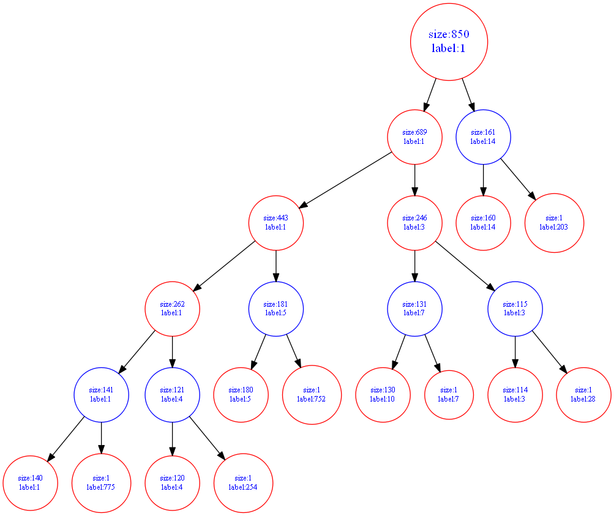

---
puppeteer:
  landscape: false
  format: "A4"
  timeout: 3000 # <= Special config, which means waitFor 3000 ms
  printBackground: true
---

 #  
 CSCI 720 Big Data Analytics HW07 Results 
 
---
Student: Guo, Zizhun & Qian, Martin
Submission: Apr/1st/2020
Due Date: Apr/1st/2020 11:59 PM 

---

a. Which two attributes are most strongly cross-correlated with each other? ( ¼ )
> Corn & Tortya

b. Which attribute is fish most strongly cross-correlated with? ( ¼ )
> Eggs

c. Which attribute is meat most strongly cross-correlated with? (¼)
> Sauce

d. Which attribute is beans most strongly cross-correlated with? (¼)
> Meat

e. Which one attribute is least correlated with all other attributes? (¼)
> Milk

f. Which second attribute is least correlated with all other attributes? (¼)
> Fruit

g. If you were to delete two attributes, which would you guess were irrelevant? (¼)
> Milk & Fruit

h. If buying fish is strongly cross-correlated with buying cereal, and buying cereal is strongly crosscorrelated with buying baby products, is buying fish strongly cross-correlated with buying baby products? Can you explain this? (¼)

final clustering result:

1. ( 1 ) When you have clustered to six clusters, report the size of each cluster, from lowest to highest. 
115 121 131 140 161 181 

2. ( 1 ) When you have clustered to six clusters, report the average prototype of these six clusters.

3. ( 1 ) What typifies each of the six clusters?  What name should we give each of these prototypes? 

6. ( 5 ) Write a conclusion about what you learned overall.   If each of you learned different things, tell me what each of you learned. 